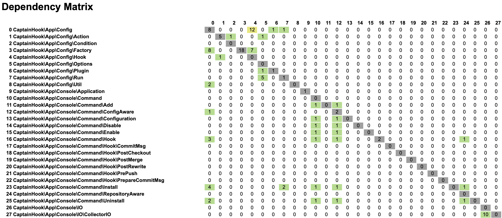
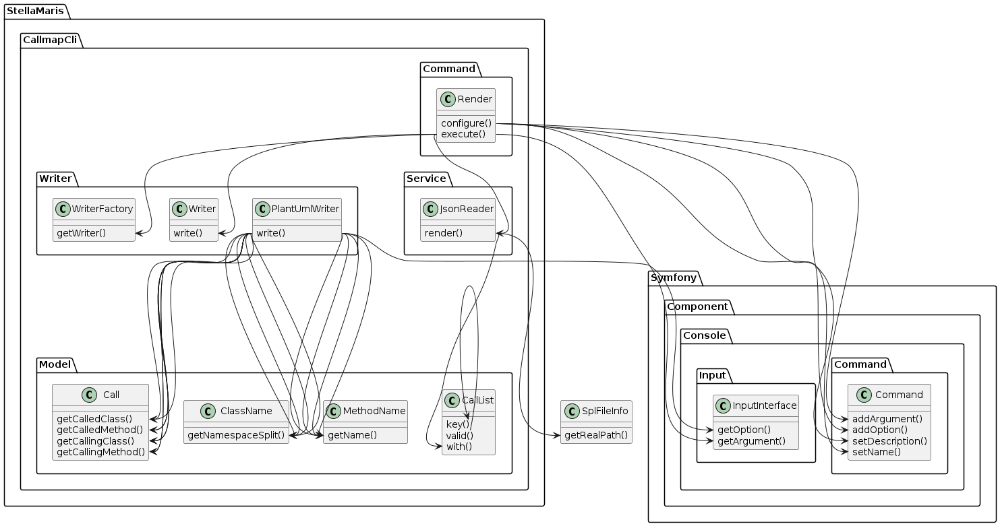

# PHPDepend
PHPStan plugin to create a dependency matrix inspired by N-Depend

## matrix - subcommand

Create a dependency matrix html file based on the call

```bash
./bin/phpdepend matrix <path/to/callmap.json>
```



## Full chain:

```bash
# Install PHPStan
composer require --dev phpstan/phpstan 1.11.x-dev
# Install plugin
composer require --dev phpdepend/callmap dev-main
# parse the sources and generate the callmap.json file
./vendor/bin/phpstan analyse -c vendor/phpdepend/callmap/callmap.neon [path/to/your/sources]
# Install the callmap cli
composer require phpdepend/phpdepend@dev-main
# Convert the callmap.json file into a matrix.html file
./bin/phpdepend matrix callmap.json
```

## graph - subcommand

Create an overview of your applications method-calls.
Graph generates a PlantUML file from a CallMap-JSON file.

### Usage

After you have created a callmap-JSON file (for example via the stella-maris/callmap
plugin for PHPStan) you can create the PlantUML file via this command:

```bash
./bin/phpdepend graph <path/to/callmap.json>
```

This will generate a PlantUML file in the current directory names `callmap.plantuml`.

You can use this file to generate a PNG os SVG using a PlantUML renderer like at
http://www.plantuml.com/plantuml/uml/

For the [`phpdepend/callmap`](https://github.com/phpdepend/callmap) plugin that should generate something like this:




## Full chain:

```bash
# Install PHPStan
composer require --dev phpstan/phpstan 1.11.x-dev
# Install plugin
composer require --dev phpdepend/callmap dev-main
# parse the sources and generate the callmap.json file
./vendor/bin/phpstan analyse -c vendor/phpdepend/callmap/callmap.neon [path/to/your/sources]
# Install the callmap cli
composer require phpdepend/phpdepend@dev-main
# Convert the callmap.json file into a callmap.plantuml file
./bin/phpdepend graph callmap.json
# Render a PNG file from the callmap.plantuml file
docker run -v "$(pwd):/app" -w "/app" ghcr.io/plantuml/plantuml callmap.plantuml
```
